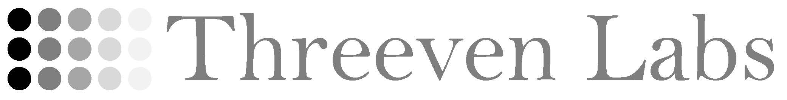

### Artificial intelligence for prosperity and radiance.
  
### Contact: threeven.labs@gmail.com
  

  
### Principal: 
  
Dr. <a href="https://kevincrawfordknight.github.io/">Kevin Knight</a> is an academic and serial entrepreneur. He served as a professor of computer science at the University of Southern California (26 years), as Chief Scientist at <a href="https://en.wikipedia.org/wiki/Language_Weaver">Language Weaver, Inc.</a> (9 years), and as Chief Scientist for Natural Language Processing at <a href="https://en.wikipedia.org/wiki/DiDi">Didi Global</a> (4 years). He received a PhD in computer science from Carnegie Mellon University and a bachelor's degree from Harvard University.  Dr. Knight's research interests include human-machine communication, machine translation, language generation, automata theory, decipherment of historical documents, and AI for transportation.  He has co-authored over 150 research papers on natural language processing, as well as the books <a href="https://www.amazon.com/Artificial-Intelligence-Elaine-Rich/dp/0070522634/ref=sr_1_1?crid=2T2C6WLG6626J&keywords=artificial+intelligence+knight&qid=1662239723&sprefix=artificial+intelligence+knight%2Caps%2C172&sr=8-1">Artificial Intelligence</a> (1990), <a href="https://www.amazon.com/gp/product/B0B92QRT3D/ref=ox_sc_saved_image_1?smid=A1Y53T3O3Q25L8&psc=1">Math Kook</a> (2022), and <a href="https://www.amazon.com/gp/product/B0B92HRJWG/ref=crt_ewc_img_dp_1?ie=UTF8&psc=1&smid=ATVPDKIKX0DER">In Theory</a> (2022).  Dr. Knight served as President of the Association for Computational Linguistics (ACL) in 2011, as General Chair for ACL in 2005, as General Chair for the North American ACL in 2016, and as co-program chair for the first Asia-Pacific ACL (2020).  He is a Fellow of the ACL and a Fellow of the Association for the Advancement of Artificial Intelligence (AAAI).

